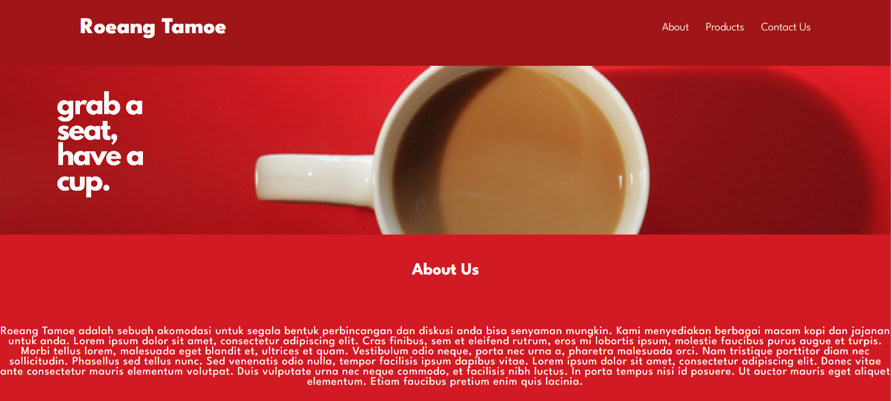
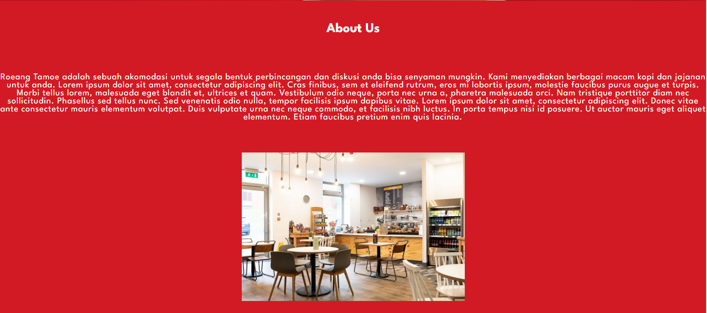
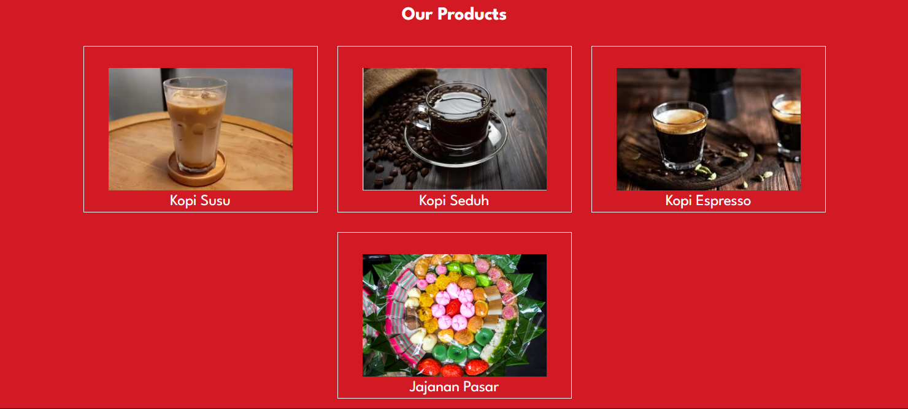
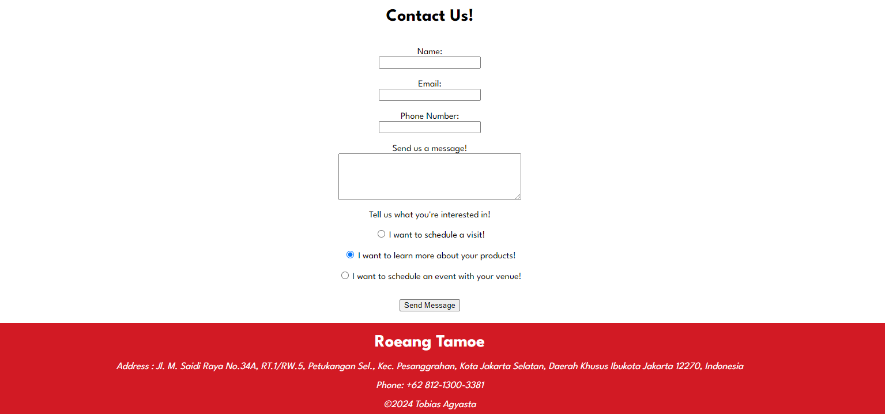
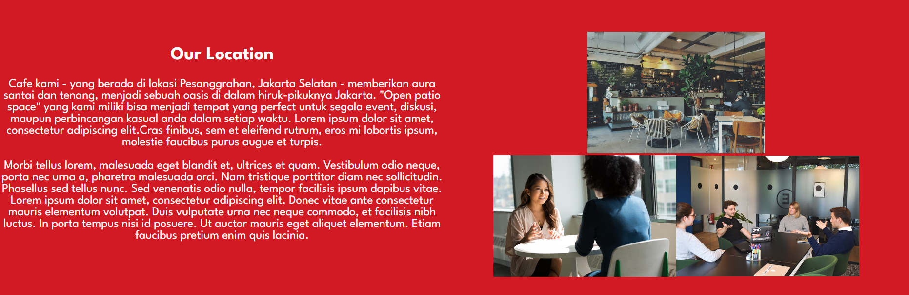

# Roeang Tamoe
### Module 1 Assignment for RevoU FSSE Amsterdam
#### By Tobias Agyasta (Team 2)

This is my submission for the Module 1 assignment. This is a website that serves as a landing page for my mother's business : a meeting space / coffee shop called **"Roeang Tamoe"**, situated in Pesanggrahan, Jakarta Selatan.

In this website, I plan to give an explanation about the business. In the *About Us* section, there are information about the shared co-working space for rent in the business. In the *Products* section, there are information about the types of coffee in which we serve. In the *Contact Us* section, there is a form for the users to connect with us and schedule for our services.

In the final addition to the assignment, I added a grid section title "Our Location" and added responsive elements, such as a working hamburger button for phone screens, as well as a sticky nav bar that changes opacity during scrolling events. For these new additions, I added a few Javascript functions.

Here are the image and web previews:  

[**Website preview using Netlify**](https://roeang-tamoe.netlify.app/)

